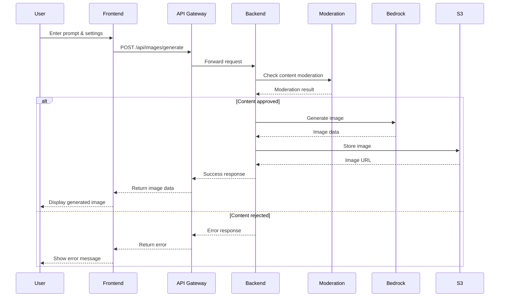
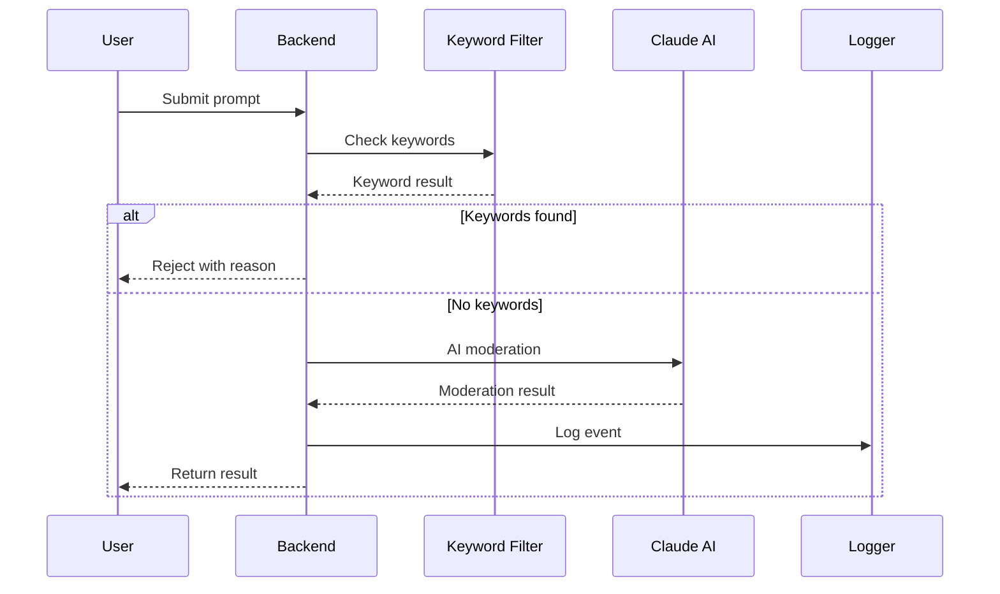

# 🏗️ Architecture Documentation

## System Overview

The GenAI Image Generator is built as a modern, scalable, cloud-native application leveraging AWS services for AI-powered image generation. The architecture follows microservices principles with clear separation of concerns.

## High-Level Architecture

```
┌─────────────────────────────────────────────────────────────────┐
│                        Client Layer                             │
├─────────────────────────────────────────────────────────────────┤
│  React Frontend (TypeScript + Tailwind CSS)                    │
│  • Responsive UI Components                                    │
│  • Image Gallery & Management                                  │
│  • Real-time Generation Status                                 │
└─────────────────────────────────────────────────────────────────┘
                                │
                                ▼
┌─────────────────────────────────────────────────────────────────┐
│                      API Gateway Layer                          │
├─────────────────────────────────────────────────────────────────┤
│  AWS API Gateway + Lambda                                      │
│  • Request Routing & Load Balancing                            │
│  • Authentication & Authorization                              │
│  • Rate Limiting & Throttling                                  │
│  • CORS & Security Headers                                     │
└─────────────────────────────────────────────────────────────────┘
                                │
                                ▼
┌─────────────────────────────────────────────────────────────────┐
│                     Application Layer                           │
├─────────────────────────────────────────────────────────────────┤
│  Express.js Backend (Node.js)                                  │
│  • RESTful API Endpoints                                       │
│  • Business Logic & Validation                                 │
│  • Content Moderation Service                                  │
│  • Image Processing Pipeline                                   │
└─────────────────────────────────────────────────────────────────┘
                                │
                                ▼
┌─────────────────────────────────────────────────────────────────┐
│                      AI Services Layer                          │
├─────────────────────────────────────────────────────────────────┤
│  AWS Bedrock                                                   │
│  • Stable Diffusion XL v1                                      │
│  • Titan Image Generator                                       │
│  • Claude for Content Moderation                               │
└─────────────────────────────────────────────────────────────────┘
                                │
                                ▼
┌─────────────────────────────────────────────────────────────────┐
│                      Storage Layer                              │
├─────────────────────────────────────────────────────────────────┤
│  Amazon S3 + CloudFront                                        │
│  • Generated Image Storage                                     │
│  • CDN for Fast Delivery                                       │
│  • Metadata & Analytics                                        │
└─────────────────────────────────────────────────────────────────┘
```

## Component Architecture

### Frontend Architecture

```
src/
├── components/           # Reusable UI components
│   ├── ui/              # Base UI components
│   ├── Layout.tsx       # Main layout wrapper
│   └── ImageGenerator/  # Image generation components
├── pages/               # Route components
│   ├── Home.tsx         # Landing page
│   ├── Generator.tsx    # Image generation interface
│   ├── Gallery.tsx      # Image gallery
│   └── About.tsx        # About page
├── hooks/               # Custom React hooks
├── services/            # API service layer
├── stores/              # State management (Zustand)
├── types/               # TypeScript type definitions
└── utils/               # Utility functions
```

### Backend Architecture

```
src/
├── index.js             # Application entry point
├── routes/              # Express route handlers
│   ├── imageRoutes.js   # Image generation endpoints
│   ├── moderationRoutes.js # Content moderation
│   └── healthRoutes.js  # Health check endpoints
├── services/            # Business logic services
│   ├── imageGenerationService.js
│   ├── contentModerationService.js
│   └── s3Service.js
├── middleware/          # Express middleware
│   ├── auth.js          # Authentication
│   ├── errorHandler.js  # Error handling
│   └── requestLogger.js # Request logging
├── utils/               # Utility functions
└── config/              # Configuration files
```

## Data Flow

### Image Generation Flow



### Content Moderation Flow



## Security Architecture

### Authentication & Authorization

```
┌─────────────────┐    ┌─────────────────┐    ┌─────────────────┐
│   API Key       │───▶│  Validation     │───▶│  Permissions    │
│   (Header)      │    │  Middleware     │    │  Check          │
└─────────────────┘    └─────────────────┘    └─────────────────┘
                                │
                                ▼
                       ┌─────────────────┐
                       │  Rate Limiting  │
                       │  (100 req/15min)│
                       └─────────────────┘
```

### Security Layers

1. **API Gateway Security**
   - HTTPS enforcement
   - CORS configuration
   - Request validation

2. **Application Security**
   - API key authentication
   - Input sanitization
   - SQL injection prevention
   - XSS protection

3. **Infrastructure Security**
   - VPC isolation
   - Security groups
   - IAM roles and policies
   - CloudTrail logging

## Performance Architecture

### Caching Strategy

```
┌─────────────────┐    ┌─────────────────┐    ┌─────────────────┐
│   CDN Cache     │    │  Application    │    │  Database       │
│   (CloudFront)  │    │  Cache (Redis)  │    │  Cache          │
└─────────────────┘    └─────────────────┘    └─────────────────┘
        │                       │                       │
        ▼                       ▼                       ▼
   Static Assets         Session Data            Query Results
   (Images, CSS, JS)     (User preferences)      (Model configs)
```

### Load Balancing

- **Application Load Balancer**: Routes traffic to healthy instances
- **Auto Scaling**: Automatically scales based on demand
- **Health Checks**: Monitors service health and removes unhealthy instances

## Monitoring & Observability

### Metrics Collection

```yaml
Application Metrics:
  - Request count and response times
  - Error rates and types
  - Image generation success rate
  - Content moderation statistics

Infrastructure Metrics:
  - CPU and memory utilization
  - Network I/O
  - Disk usage
  - Lambda execution metrics

Business Metrics:
  - Images generated per day
  - User engagement
  - Popular prompts and styles
  - API usage patterns
```

### Logging Strategy

```
┌─────────────────┐    ┌─────────────────┐    ┌─────────────────┐
│   Application   │───▶│   CloudWatch    │───▶│   Log Analysis  │
│   Logs          │    │   Logs          │    │   & Alerting    │
└─────────────────┘    └─────────────────┘    └─────────────────┘
                                │
                                ▼
                       ┌─────────────────┐
                       │   Dashboard     │
                       │   (Grafana)     │
                       └─────────────────┘
```

## Scalability Design

### Horizontal Scaling

- **Stateless Design**: Backend services are stateless for easy scaling
- **Container Orchestration**: Docker containers with Kubernetes/EKS
- **Database Scaling**: Read replicas and connection pooling
- **CDN Distribution**: Global content delivery

### Vertical Scaling

- **Lambda Configuration**: Adjustable memory and timeout
- **EC2 Instance Types**: Auto-scaling based on load
- **Database Resources**: RDS instance scaling

## Disaster Recovery

### Backup Strategy

1. **Application Data**: Daily automated backups
2. **User Images**: S3 versioning and cross-region replication
3. **Configuration**: Infrastructure as Code (CloudFormation)
4. **Database**: Automated RDS snapshots

### Recovery Procedures

1. **RTO (Recovery Time Objective)**: 4 hours
2. **RPO (Recovery Point Objective)**: 1 hour
3. **Failover**: Multi-region deployment
4. **Testing**: Monthly disaster recovery drills

## Cost Optimization

### Resource Optimization

- **Lambda Cold Start**: Provisioned concurrency for critical functions
- **S3 Lifecycle**: Automatic transition to cheaper storage tiers
- **CDN Caching**: Reduce origin requests
- **Auto Scaling**: Scale down during low usage

### Cost Monitoring

- **AWS Cost Explorer**: Track spending by service
- **Budget Alerts**: Set spending limits and notifications
- **Resource Tagging**: Track costs by project/environment
- **Optimization Recommendations**: AWS Trusted Advisor

## Compliance & Governance

### Data Privacy

- **GDPR Compliance**: Data minimization and user consent
- **Data Encryption**: At rest and in transit
- **Access Controls**: Principle of least privilege
- **Audit Logging**: Comprehensive activity tracking

### Ethical AI

- **Content Moderation**: Multi-layer safety checks
- **Bias Detection**: Automated bias identification
- **Transparency**: Clear AI usage guidelines
- **User Control**: Opt-out mechanisms and data deletion

## Future Enhancements

### Planned Features

1. **Advanced Models**: Integration with additional AI models
2. **Batch Processing**: Bulk image generation
3. **Custom Training**: Fine-tuned models for specific domains
4. **Collaboration**: Team workspaces and sharing
5. **Analytics**: Advanced usage analytics and insights

### Technical Improvements

1. **GraphQL API**: More flexible data querying
2. **Real-time Updates**: WebSocket integration
3. **Offline Support**: Progressive Web App features
4. **Mobile App**: Native iOS/Android applications
5. **Edge Computing**: Lambda@Edge for global performance